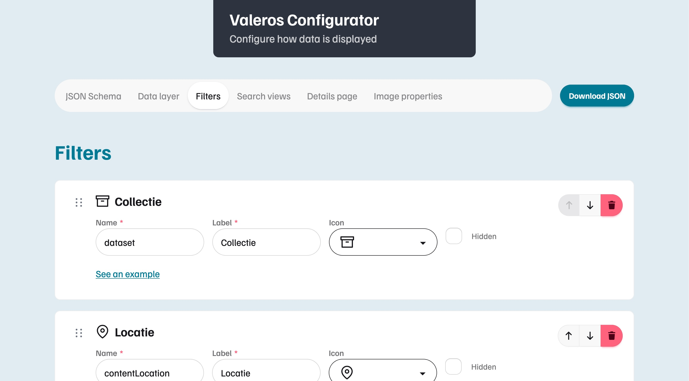
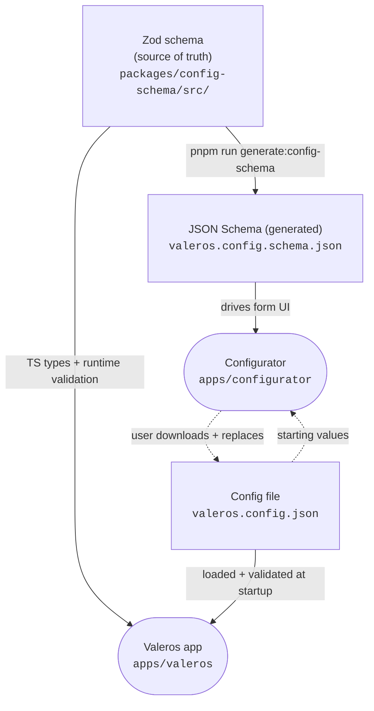
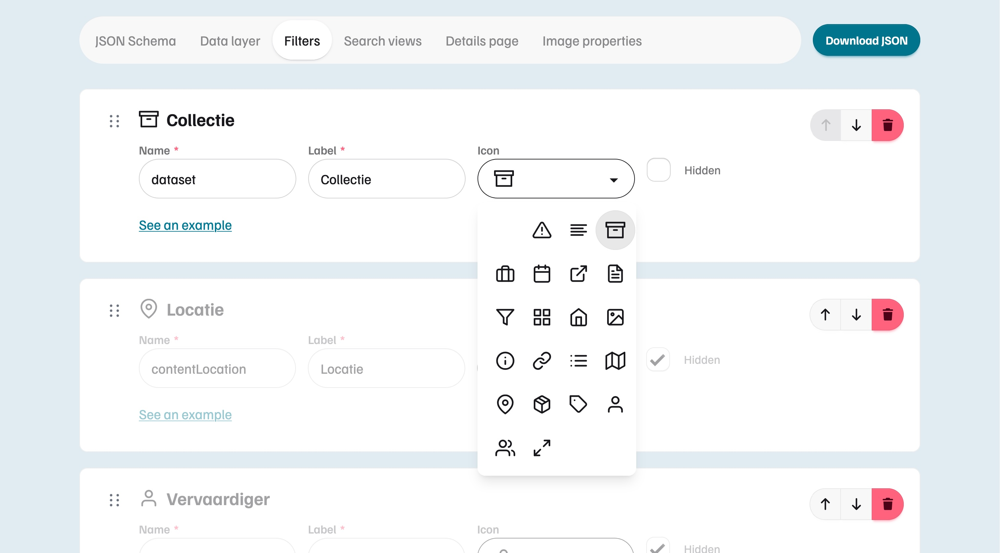

# Configuration System

Valeros is configured through a single JSON file. A [Zod](https://zod.dev/) schema is the single source of truth from which both the JSON Schema and Valeros TypeScript types are derived.



<span class="media-caption">The Valeros Configurator allows you to generate a Valeros configuration file (<code>valeros.config.json</code>) through an intuitive web interface.</span>

## Configuring Valeros

Use the **Configurator** app (a standalone React app) to edit configuration:

1. Run the Configurator: `pnpm run configurator:dev`
2. Open `http://localhost:5173/` and adjust settings
3. Download the generated JSON
4. Replace `apps/valeros/public/config/valeros.config.json` with the downloaded file

If you prefer, you can also edit the JSON config file (`valeros.config.json`) directly in your editor. The `$schema` reference at the top provides autocompletion and validation in your editor:

```json
{
  "$schema": "./valeros.config.schema.json",
  "api": { "baseUrl": "https://datalaag.valeros.nl/v1" },
  "facets": [],
  "views": { ... }
}
```

## How It Works



The Zod schema is the single source of truth. It generates the JSON Schema and provides TypeScript types and runtime validation directly to the Valeros app. The Configurator uses the JSON Schema to render its form UI and outputs a JSON config file that the app loads at startup.

## Modifying the Schema

When adding or changing a configurable property, update the Zod schema in `packages/config-schema/src/`, then run `pnpm run generate:config-schema` to regenerate the JSON Schema. The Configurator and editor tooling pick up the changes automatically.

If your schema change affects the shape of the config (new required fields, renamed keys, etc.), you might need to update `valeros.config.json` accordingly (see [Configuring Valeros](#configuring-valeros)).

## Icon Registry

The icon registry (`packages/icon-registry/src/index.ts`) maps string icon keys to SVG strings from the [@ng-icons](https://ng-icons.github.io/ng-icons/) library. The available keys are defined as a Zod enum (`IconKey`) in `packages/config-schema/src/icon.schema.ts`.



<span class="media-caption">Selecting a facet icon from the icon registry through the Valeros Configurator.</span>

### Adding a New Icon

#### 1. Add the key to the schema

In `packages/config-schema/src/icon.schema.ts`, add the new key to the `IconKeySchema` enum:

```ts
export const IconKeySchema = z.enum([
  // ... existing keys
  'new-icon',
]);
```

Then regenerate the JSON Schema so the Configurator and editor tooling pick it up:

```sh
pnpm run generate:config-schema
```

#### 2. Register the icon

Import the icon from `@ng-icons/feather-icons` (or another [@ng-icons](https://ng-icons.github.io/ng-icons/) icon set) and add it to `ICON_REGISTRY` in `packages/icon-registry/src/index.ts`:

```ts
import {
  // ... existing imports
  featherNewIcon,
} from '@ng-icons/feather-icons';

export const ICON_REGISTRY: Record<IconKey, string> = {
  // ... existing entries
  'new-icon': featherNewIcon,
};
```
