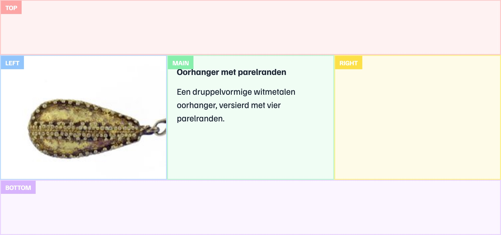
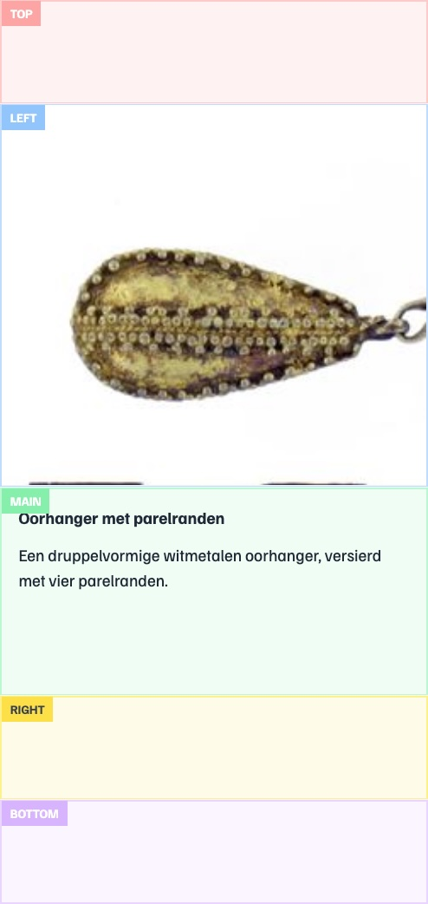

# Configuring Object Presentation (Widget System)

Valeros allows you to control how heritage objects are displayed to end users through simple configuration files.

<video controls>
  <source src="./widgets.mp4" type="video/mp4">
  Your browser does not support the video tag.
</video>

<span class="video-caption">Video: Hiding widgets to customize how objects are displayed in list view</span>

## Presentation Configuration Files

Object presentation is controlled through configuration files in `src/app/config/presentation/`:

- **`list-presentation.config.ts`** - Configure how objects appear in list view
- **`grid-presentation.config.ts`** - Configure how objects appear in grid view
- **`map-presentation.config.ts`** - Configure how objects appear on the map
- **`details-presentation.config.ts`** - Configure how objects appear on the details page

Each configuration file exports a `NodePresentationConfig` object that defines which widgets are available and how they should be displayed.

::: info "Objects" or "nodes"?
Throughout this documentation, we use "object" and "node" somewhat interchangeably. Internally, Valeros uses "node" in the linked data sense (hence `NodePresentationConfig`), but in these guides we typically use "object" for clarity. Both refer to the same thing: a heritage object, person, place, or other entity in your dataset.
:::

## Basic Structure

A presentation config has the following structure:

```ts
export const DETAILS_PRESENTATION_CONFIG: NodePresentationConfig = {
  widgets: [
    nameWidget,
    descriptionWidget,
    mediaWidget,
    // ... more widgets
  ],
};
```

### Configuration Properties

- **`widgets`** - Array of widgets that defines which widgets are shown and in what order
- **`showArrowIndicator`** - Whether to show an arrow indicator on clickable items (optional)

## What is a Widget?

The **widget system** is the core of Valeros's configuration-driven approach. Widgets let you map data properties (`creator`, `dateCreated`, `associatedMedia`, ...) to visual components (`LinkWidget`, `TextWidget`, `MediaWidget`, ...) **without writing code**. Instead of building custom components for each data type, you configure which (reusable) widgets handle which properties.

## Understanding Widgets

Each widget is an object that connects data properties to visual components:

```ts
export const materialWidget: Widget = {
  id: 'material',
  properties: ['material'],
  componentId: 'link-widget',
  options: {
    propertyLabel: 'Materiaal',
    icon: 'package',
  },
};
```

### Widget Properties

- **`id`** - Unique identifier for the widget
- **`properties`** - Array of data property names this widget handles (optional, see [Widgets Without Properties](#widgets-without-properties))
- **`componentId`** - The component used to render this widget (see [Built-in Widgets](/guide/built-in-widgets) for available components)
- **`options`** - Configuration options passed to the widget component (optional)
- **`isFallback`** - When true, this widget handles any properties that have data but don't match other widgets (optional, see [Handling Unmatched Properties](#handling-unmatched-properties))

### Widget Options

All widgets support **base options** like `propertyLabel`, `icon`, and `position` (defined in `BaseWidgetOptions`).

Individual widget components can extend these with **component-specific options**. For example, `TextWidgetOptions` (used by `TextWidget`) extends `BaseWidgetOptions` to add `maxLength`, `largeFont`, and other text-specific options.

## Widget Positioning

Widgets can be positioned in different areas using the `position` option.

::: tip Implementation Details
The widget positioning layout structure is defined in `NodeComponent`. Widget position grouping logic is handled by `WidgetService`.
:::

### Available Positions



- **`top`** - Full-width area at the top
- **`left`** - Left sidebar (on desktop)
- **`main`** - Main content area (default)
- **`right`** - Right sidebar (on desktop)
- **`bottom`** - Full-width area at the bottom

### Example: Positioning Widgets

```ts
export const mediaWidget: Widget = {
  id: 'media',
  properties: ['associatedMedia'],
  componentId: 'media-widget',
  options: {
    showPropertyLabel: false,
    position: 'left', // Display in left sidebar
  },
};

export const imageThumbWidget: Widget = {
  id: 'image-thumb',
  properties: ['associatedMedia'],
  componentId: 'image-gallery-widget',
  options: {
    position: 'top', // Display at the top
    noPadding: true, // Extend edge-to-edge, strip default padding
  },
};
```

### Responsive Behavior



On mobile devices, the layout collapses into a single column in this order:

1. Top
2. Left
3. Main
4. Right
5. Bottom

## Common Tasks

### Changing Widget Order

Widgets are displayed in the order they appear in the `widgets` array. Simply reorder the widgets:

```ts
export const DETAILS_PRESENTATION_CONFIG: NodePresentationConfig = {
  widgets: [
    mediaWidget, // Shows first
    nameWidget, // Shows second
    descriptionWidget, // Shows third
  ],
  // ...
};
```

### Showing Widgets for Properties

To display a widget for a property in your data, create a widget configuration that maps the property to an existing widget component.

**Option 1: Define in `widgets.ts` (recommended for reusability)**

```ts
export const customWidget: Widget = {
  id: 'custom',
  properties: ['customProperty'],
  componentId: 'link-widget',
  options: {
    propertyLabel: 'Custom Field',
    icon: 'star',
  },
};
```

Then import and add it to your presentation config:

```ts
import { customWidget } from './widgets/widgets';

export const DETAILS_PRESENTATION_CONFIG: NodePresentationConfig = {
  widgets: [
    nameWidget,
    customWidget,
    // ...
  ],
  // ...
};
```

**Option 2: Define inline (for view-specific widgets)**

```ts
export const DETAILS_PRESENTATION_CONFIG: NodePresentationConfig = {
  widgets: [
    nameWidget,
    {
      id: 'custom',
      properties: ['customProperty'],
      componentId: 'link-widget',
      options: {
        propertyLabel: 'Custom Field',
        icon: 'star',
      },
    },
  ],
  // ...
};
```

::: tip
This section covers using existing widgets (see [Built-in Widgets](/guide/built-in-widgets)) for your properties. To create entirely new widget components with custom functionality, see [Creating Custom Widgets](/guide/custom-widgets).
:::

### Passing Custom Options to Widgets

Widget options allow you to customize behavior. Here's an example with multiple options:

```ts
export const descriptionWidget: Widget = {
  id: 'description',
  properties: ['description'],
  componentId: 'link-widget',
  options: {
    showPropertyLabel: false, // Hide the property label
    largeFont: true, // Use larger font
    maxLength: 200, // Truncate at 200 characters
  },
};
```

Different widget components accept different options. Check the widget's implementation to see available options.

### Widgets Without Properties

Widgets can omit the `properties` field if they don't depend on specific data properties:

```ts
export const separatorWidget: Widget = {
  id: 'separator',
  componentId: 'separator-widget',
  options: {
    showPropertyLabel: false,
  },
};
```

These widgets will always appear when included in the `widgets` array:

```ts
export const DETAILS_PRESENTATION_CONFIG: NodePresentationConfig = {
  widgets: [
    nameWidget,
    separatorWidget, // Always appears at this position
    descriptionWidget,
  ],
};
```

### Handling Unmatched Properties

Use a fallback widget to display properties that don't have specific widgets defined. Set `isFallback: true` on a widget:

```ts
export const fallbackWidget: Widget = {
  id: 'fallback',
  componentId: 'json-widget',
  isFallback: true, // This widget handles unmatched properties
};
```

The fallback widget's position in the `widgets` array determines where unmatched properties appear:

```ts
export const DETAILS_PRESENTATION_CONFIG: NodePresentationConfig = {
  widgets: [
    nameWidget,
    descriptionWidget,
    fallbackWidget, // Unmatched properties appear here
    datasetWidget,
  ],
};
```

In this example, `name`, `description` and `dataset` properties are matched by their respective widgets. Other properties like `type` or `birthDate` that don't match any specific widget would be handled by the `fallbackWidget`.

::: tip
Widget matching logic is implemented in `WidgetService`. Check out `src/app/widgets/widget.service.ts` for details.
:::
