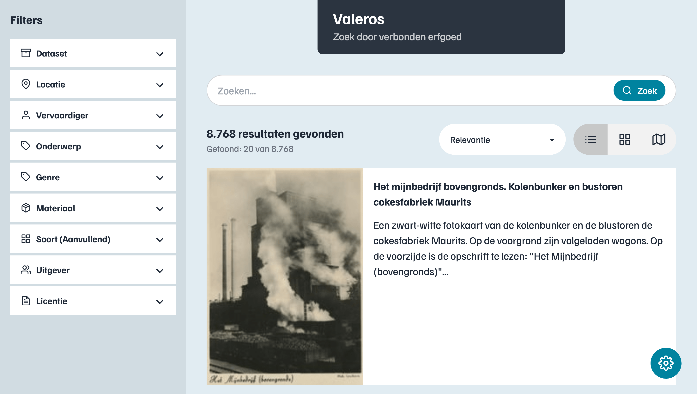
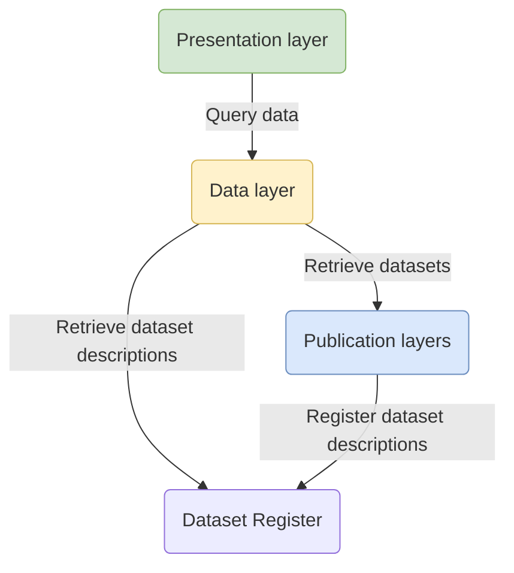

# What is Valeros?

Valeros is a **reusable, flexible heritage data browser**.

It is designed as a standard solution for **targeted search** and **browsing and discovery** of heritage data. See the [Netwerk Digitaal Erfgoed](https://netwerkdigitaalerfgoed.nl/en/) (NDE) [behavior profiles publication](https://zenodo.org/records/14938780) for more information about these types of users and their needs.

As a developer, Valeros lets you control what, how, and when data is shown to end users through a **JSON configuration file** (see [Configuration System](/guide/configuration-system)).

## Key Features

### Search & Discovery

- **Full-text search** - Find heritage objects across all indexed fields
- **Faceted filtering** - Narrow results by categories like date, location, or type
- **Autocomplete** - Get suggestions as you type
- **Sorting** - Order results by relevance, date, or custom criteria
- **Connected heritage** - Discover related objects that share the same terms, people, or places

### Data Presentation

- **Flexible layouts** - Display results as lists, grids, maps, or [create your own views](/guide/custom-views)
- **Built-in widgets** - Ready-to-use components for maps, images, IIIF viewers, and more, or [create your own](/guide/custom-widgets)
- **Detail pages** - Dedicated pages for individual heritage objects with rich metadata
- **IIIF support** - View high-resolution images with zoom and pan capabilities
- **Source provenance** - Always link back to the original data source for transparency

## Architecture

### Tech Stack

Valeros is built with [Angular](https://angular.dev/) following the [Angular style guide](https://angular.dev/style-guide). We use modern Angular features including [signals](https://angular.dev/essentials/signals) for reactive state management, [standalone components](https://angular.dev/essentials/components), and [control flow syntax](https://angular.dev/guide/templates/control-flow). For styling, we use [**TailwindCSS**](https://tailwindcss.com/) with [**DaisyUI**](https://daisyui.com/) as the component library.

### Data & Presentation Layers

Valeros follows the [NDE vision](https://zenodo.org/records/17541400) of **explicit separation between data and presentation layers**:

- The **data layer** retrieves datasets registered in the [**NDE Dataset Register**](https://datasetregister.netwerkdigitaalerfgoed.nl/) and provides a standardized API. NDE's data layer specification is still in development, so both GraphQL and REST implementations are supported. See [Getting Started](/guide/getting-started) for available implementations and how to configure them.
- The **presentation layer** (this project, Valeros) consumes the API and allows configuration of how data is displayed.

